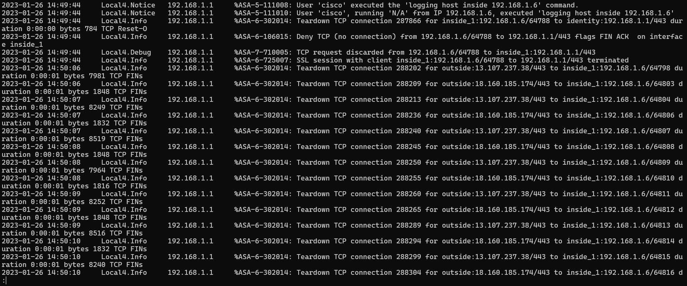
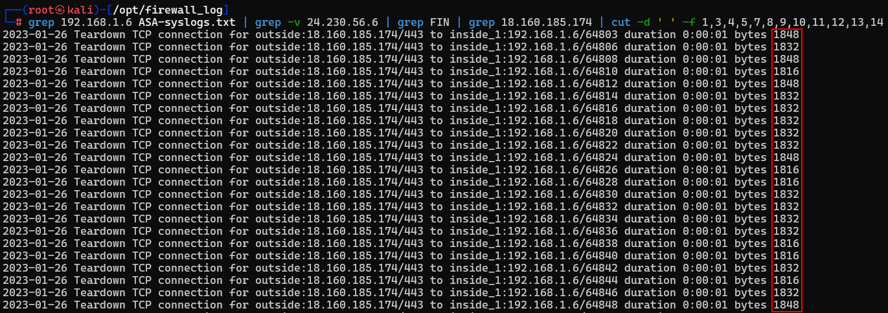
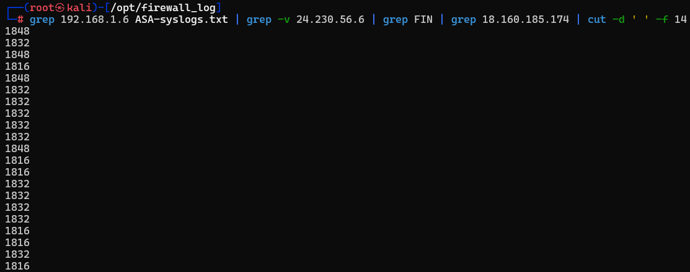

# Firewall Log Review

In this lab we will be looking at a log from an **ASA firewall** from Cisco.

**And wow....  They are bad to work with.**

With the power of **Bash scripting** we can get some useful information.

Let’s get started by opening a **Kali** Instance.

Alternatively, you can click on the **Kali Logo** in the taskbar.

Let's start by gaining root access by running the following:

<pre>sudo su -</pre>

Next, we can run the following:

<pre>sudo apt install r-base-core</pre>

If prompted with "Do you want to continue? Y/n", go ahead and press **Y** and hit **enter**.

Next, let's get your **Linux** system to do some math!

We need to navigate to the correct directory with the following command:

<pre>cd /opt/firewall_log</pre>

Let's look into the logs.  The logs file is quite extensive, so in order to narrow our scope, we will use **"grep".**

<pre>grep 192.168.1.6 ASA-syslogs.txt | grep -v 24.230.56.6 | less</pre>

**That is a nightmare...**

Not only is there a ton of information here, you might now feel like you are stuck in your terminal window.

No worries though, just hit **"q"** to return to your terminal.

Let's refine the output a little more by running the following command:

<pre>grep 192.168.1.6 ASA-syslogs.txt | grep -v 24.230.56.6 | grep FIN | cut -d ' ' -f 1,3,4,5,7,8,9,10,11,12,13,14</pre>

This command focuses on the closed connections **(FIN)** and pull just specific fields out of the data to clean it up.   We use cut with the **"-d"** switch to specify the delimiter, which is a space.  Then, we tell it what fields or columns of the output we are interested in. 

When it is all put together, our output looks something like this:

It's looking a lot better, but I think we can do better. But how?

If you look at our previous output, you may notice that outside connections are being made to two different addresses:
**"13.107.237.38"** and **"18.160.185.174"**

So why don't we look at just the connections made to **"13.107.237.38"** by running the following command:

<pre>grep 192.168.1.6 ASA-syslogs.txt | grep -v 24.230.56.6 | grep FIN | grep 13.107.237.38 | cut -d ' ' -f 1,3,4,5,7,8,9,10,11,12,13,14</pre>

This output shows us all of the data coming from **"13.107.237.38"**

Don't forget, there were also a lot of connections from **"18.160.185.174"**.  Here, let's zoom in on that IP as well:

<pre>grep 192.168.1.6 ASA-syslogs.txt | grep -v 24.230.56.6 | grep FIN | grep 18.160.185.174 | cut -d ' ' -f 1,3,4,5,7,8,9,10,11,12,13,14</pre>

Look at the last field.  See a pattern?  Is there one?  Let's see just that field!

<pre>grep 192.168.1.6 ASA-syslogs.txt | grep -v 24.230.56.6 | grep FIN | grep 18.160.185.174 | cut -d ' ' -f 14</pre>

All we should see now is this:

Now let's do some math in that field!

<pre>grep 192.168.1.6 ASA-syslogs.txt | grep -v 24.230.56.6 | grep FIN | grep 18.160.185.174 | cut -d ' ' -f 8,14 | tr : ' ' | tr / ' '  | cut -d ' ' -f 4 | Rscript -e 'y <-scan("stdin", quiet=TRUE)' -e 'cat(min(y), max(y), mean(y), sd(y), var(y), sep="\n")'</pre>
 
Your output should look something like this:

There are a lot of commands you can use to alter your view of the logs.  

***
***Continuing on to the next Lab?***

[Click here to get back to the Navigation Menu](/IntroClassFiles/navigation.md)

***Finished with the Labs?***

Please be sure to destroy the lab environment!

[Click here for instructions on how to destroy the Lab Environment](/IntroClassFiles/Tools/IntroClass/LabDestruction/labdestruction.md)

---
